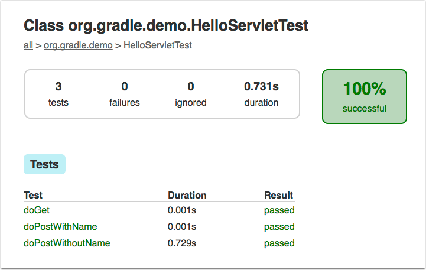

# 构建Java Web应用程序

## 搭建Web应用程序的目录结构

Gradle包含一个war插件，在用户手册的WAR插件一章中进行了介绍。 war插件扩展了Java插件，以添加对Web应用程序的支持。 默认情况下，它使用一个名为src/main/webapp的文件夹来获取与Web相关的资源。
因此，为名为webdemo的项目创建以下文件结构：

	webdemo/
	    src/
		main/
		    java/
		    webapp/
		test
		    java/

任何servlet或其他Java类都将放在src/main/java中，测试将进入src/test/java，其他Web工件将进入src/main/webapp。

## Add a Gradle build file
将名为build.gradle（如果使用Groovy DSL）或build.gradle.kts（如果使用Kotlin DSL）的文件添加到项目的根目录，其内容如下： 

	plugins {
	    id 'war'       //  Using the war plugin
	}

	repositories {
	    jcenter()
	}

	dependencies {
	    providedCompile 'javax.servlet:javax.servlet-api:3.1.0'    // 	Current release version of the servlet API
	    testCompile 'junit:junit:4.12'
	}

war插件添加了类似于常规Java应用程序中的compile和runtime的配置providerCompile和providerRuntime，以表示本地所需的依赖关系，但不应将其添加到生成的webdemo.war文件中。

插件语法用于应用java和war插件。 两者都不需要版本，因为它们包含在Gradle发行版中。

通过执行包装器任务为项目生成Gradle包装器是一个好习惯：

	$ gradle wrapper --gradle-version=4.10.3
	:wrapper

如用户手册的包装部分所述，这将生成gradlew和gradlew.bat脚本以及内部装有包装罐的gradle文件夹。

## 向项目添加Servlet和元数据

定义Web应用程序元数据有两个选项。 在Servlet规范的3.0版之前，元数据驻留在项目的WEB-INF文件夹中的部署描述符中，称为web.xml。 从3.0开始，可以使用注释定义元数据。

在src / main / java文件夹下创建一个软件包文件夹org / gradle / demo。 添加一个具有以下内容的servlet文件HelloServlet.java：

	package org.gradle.demo;

	import java.io.IOException;
	import javax.servlet.ServletException;
	import javax.servlet.annotation.WebServlet;
	import javax.servlet.http.HttpServlet;
	import javax.servlet.http.HttpServletRequest;
	import javax.servlet.http.HttpServletResponse;

	@WebServlet(name = "HelloServlet", urlPatterns = {"hello"}, loadOnStartup = 1)    	//  Annotation-based servlet
	public class HelloServlet extends HttpServlet {
	    protected void doGet(HttpServletRequest request, HttpServletResponse response)
		throws ServletException, IOException {
		response.getWriter().print("Hello, World!");    //GET request returns a simple string
	    }

	    protected void doPost(HttpServletRequest request, HttpServletResponse response)
		throws ServletException, IOException {
		String name = request.getParameter("name");
		if (name == null) name = "World";
		request.setAttribute("user", name);
		request.getRequestDispatcher("response.jsp").forward(request, response);  //POST request forwards to a JSP page
	    }
	}

Servlet使用@WebServlet批注进行配置。 doGet方法通过编写“ Hello，World！”来响应HTTP GET请求。 字符串输出输出。 它通过查找名为name的请求参数并将其作为名为user的属性添加到请求中，然后转发到response.jsp页面来对HTTP POST请求做出反应。

现在，您有了一个简单的servlet，它可以响应HTTP GET和POST请求。

## 将JSP页面添加到演示应用程序
通过在src / main / webapp文件夹中创建文件index.html，将索引页添加到应用程序的根目录，其内容如下：

	<html>
	<head>
	  <title>Web Demo</title>
	</head>
	<body>
	
Say <a href="hello">Hello</a>
     <!--   	Link submits GET request   -->

	<form method="post" action="hello">      <!--           Form uses POST request     -->
	  <h2>Name:</h2>
	  <input type="text" id="say-hello-text-input" name="name" />
	  <input type="submit" id="say-hello-button" value="Say Hello" />
	</form>
	</body>
	</html>

index.html页面使用一个链接向Servlet提交HTTP GET请求，并使用一个表单提交HTTP POST请求。 该表单包含一个名为name的文本字段，该servlet可以通过其doPost方法访问该文本字段。

servlet在其doPost方法中将控制权转发到另一个JSP页面，该页面称为response.jsp。 因此，请在src / main / webapp中定义具有以下名称的文件：

	<%@ page contentType="text/html;charset=UTF-8" language="java" %>
	<html>
	    <head>
		<title>Hello Page</title>
	    </head>
	    <body>
		<h2>Hello, ${user}!</h2>
	    </body>
	</html>

响应页面从请求中访问用户变量，并将其呈现在h2标签内。

## 添加gretty插件并运行应用

gretty插件是社区支持的杰出插件，可以在Gradle插件存储库中找到，网址为https://plugins.gradle.org/plugin/org.akhikhl.gretty。 该插件使在Jetty或Tomcat上运行或测试Web应用程序变得容易。

通过将以下行添加到构建脚本内的plugins块中，将其添加到我们的项目中。

	plugins {
	    id 'war'
	    id 'org.gretty' version '2.2.0'   // 	Adding the gretty plugin
	}

gretty插件向应用程序添加了大量任务，对于在Jetty或Tomcat环境中运行或测试很有用。 现在，您可以使用appRun任务将应用构建并部署到默认（Jetty）容器。

### 执行appRun任务
	$ ./gradlew appRun
	:prepareInplaceWebAppFolder
	:createInplaceWebAppFolder UP-TO-DATE
	:compileJava
	:processResources UP-TO-DATE
	:classes
	:prepareInplaceWebAppClasses
	:prepareInplaceWebApp
	:appRun
	12:25:13 INFO  Jetty 9.2.15.v20160210 started and listening on port 8080
	12:25:13 INFO  webdemo runs at:
	12:25:13 INFO    http://localhost:8080/webdemo
	Press any key to stop the server.
	> Building 87% > :appRun

	BUILD SUCCESSFUL

现在，您可以在http：// localhost：8080 / webdemo上访问该Web应用程序，然后单击链接以执行GET请求或提交表单以执行POST请求。

尽管输出显示按任意键停止服务器，但Gradle不会拦截标准输入。 要停止该过程，请按ctrl-C。
## 使用Mockito对Servlet进行单元测试

开源Mockito框架使对Java应用程序进行单元测试变得容易。 将Mockito依赖项添加到testCompile配置下的构建脚本。

	dependencies {
	    providedCompile 'javax.servlet:javax.servlet-api:3.1.0'
	    testCompile 'junit:junit:4.12'
	    testCompile 'org.mockito:mockito-core:2.7.19'   //  	Adding Mockito
	}

要对Servlet进行单元测试，请在src / test / java下创建一个软件包文件夹org.gradle.demo。 添加具有以下内容的测试类文件HelloServletTest.java：

	package org.gradle.demo;

	import org.junit.Before;
	import org.junit.Test;
	import org.mockito.Mock;
	import org.mockito.MockitoAnnotations;

	import javax.servlet.RequestDispatcher;
	import javax.servlet.http.HttpServletRequest;
	import javax.servlet.http.HttpServletResponse;
	import java.io.PrintWriter;
	import java.io.StringWriter;

	import static org.junit.Assert.assertEquals;
	import static org.mockito.Mockito.*;

	public class HelloServletTest {
	    @Mock private HttpServletRequest request;
	    @Mock private HttpServletResponse response;
	    @Mock private RequestDispatcher requestDispatcher;

	    @Before
	    public void setUp() throws Exception {
		MockitoAnnotations.initMocks(this);
	    }

	    @Test
	    public void doGet() throws Exception {
		StringWriter stringWriter = new StringWriter();
		PrintWriter printWriter = new PrintWriter(stringWriter);

		when(response.getWriter()).thenReturn(printWriter);

		new HelloServlet().doGet(request, response);

		assertEquals("Hello, World!", stringWriter.toString());
	    }

	    @Test
	    public void doPostWithoutName() throws Exception {
		when(request.getRequestDispatcher("response.jsp"))
		    .thenReturn(requestDispatcher);

		new HelloServlet().doPost(request, response);

		verify(request).setAttribute("user", "World");
		verify(requestDispatcher).forward(request,response);
	    }

	    @Test
	    public void doPostWithName() throws Exception {
		when(request.getParameter("name")).thenReturn("Dolly");
		when(request.getRequestDispatcher("response.jsp"))
		    .thenReturn(requestDispatcher);

		new HelloServlet().doPost(request, response);

		verify(request).setAttribute("user", "Dolly");
		verify(requestDispatcher).forward(request,response);
	    }
	}

该测试将为HttpServletRequest，HttpServletResponse和RequestDispatcher类创建模拟对象。 对于doGet测试，将创建一个使用StringWriter的PrintWriter，并且将模拟请求对象配置为在调用getWriter方法时将其返回。 调用doGet方法后，测试将检查返回的字符串是否正确。

对于发布请求，模拟请求被配置为返回给定名称（如果存在）或返回null，并且getRequestDispatcher方法返回关联的模拟对象。 调用doPost方法将执行请求。 然后Mockito验证是否使用适当的参数在模拟响应上调用了setAttribute方法，并验证了在请求分派器上调用了forward方法。

现在，您可以将Gradle与测试任务（或依赖于它的任何任务，例如build）一起使用Gradle进行测试。

	$ ./gradlew build
	:compileJava UP-TO-DATE
	:processResources UP-TO-DATE
	:classes UP-TO-DATE
	:war
	:assemble
	:compileTestJava
	:processTestResources UP-TO-DATE
	:testClasses
	:test
	:check
	:build

	BUILD SUCCESSFUL

可以按常规方式从build / reports / tests / test / index.html访问测试输出。 您应该得到类似于以下结果：

 

## 添加功能测试

gretty插件与Gradle结合使用，可以轻松地向Web应用程序添加功能测试。 这样做，将以下行添加到您的生成脚本：

	gretty {
	    integrationTestTask = 'test'  //Tell gretty to start and stop the server on test
	}

	// ... rest from before ...

	dependencies {
	    providedCompile 'javax.servlet:javax.servlet-api:3.1.0'
	    testCompile 'junit:junit:4.12'
	    testCompile 'org.mockito:mockito-core:2.7.19'
	    testCompile 'io.github.bonigarcia:webdrivermanager:1.6.1' //Automatically installs browser drivers
	    testCompile 'org.seleniumhq.selenium:selenium-java:3.3.1' //Uses Selenium for functional tests
	}

gretty插件需要知道哪个任务需要启动和停止服务器。 通常，这是分配给您自己的任务的，但是为了使事情简单，只需使用现有的测试任务即可。

Selenium是用于编写功能测试的流行开源API。 2.0版基于WebDriver API。 最新版本要求测试人员为他们的浏览器下载并安装WebDriver版本，这很繁琐且难以自动化。 WebDriverManager项目使Gradle可以轻松地为您处理该过程。

在src / test / java目录中，将以下功能测试添加到您的项目中：

	package org.gradle.demo;

	import io.github.bonigarcia.wdm.ChromeDriverManager;
	import org.junit.After;
	import org.junit.Before;
	import org.junit.BeforeClass;
	import org.junit.Test;
	import org.openqa.selenium.By;
	import org.openqa.selenium.WebDriver;
	import org.openqa.selenium.chrome.ChromeDriver;

	import static org.junit.Assert.assertEquals;

	public class HelloServletFunctionalTest {
	    private WebDriver driver;

	    @BeforeClass
	    public static void setupClass() {
		ChromeDriverManager.getInstance().setup();   //Downloads and installs browser driver, if necessary
	    }

	    @Before
	    public void setUp() {
		driver = new ChromeDriver();                 //Start the browser automation         
	    }

	    @After
	    public void tearDown() {
		if (driver != null)
		    driver.quit();                          //Shut down the browser when done                      
	    }

	    @Test
	    public void sayHello() throws Exception {      //Run the functional test using the Selenium API
		driver.get("http://localhost:8080/webdemo");

		driver.findElement(By.id("say-hello-text-input")).sendKeys("Dolly");
		driver.findElement(By.id("say-hello-button")).click();

		assertEquals("Hello Page", driver.getTitle());
		assertEquals("Hello, Dolly!", driver.findElement(By.tagName("h2")).getText());
	    }
	}

此测试的WebDriverManager部分检查二进制文件的最新版本，并在不存在该二进制文件时下载并安装它。 然后，sayHello测试方法将Chrome浏览器驱动到我们应用程序的根目录，填写输入文本字段，单击按钮，并验证目标页面的标题，并且h2标签包含预期的字符串。

WebDriverManager系统支持Chrome，Opera，Internet Explorer，Microsoft Edge，PhantomJS和Firefox。 查看项目文档以获取更多详细信息。
## 运行功能测试

使用测试任务运行测试：

	$ ./gradlew test
	:prepareInplaceWebAppFolder UP-TO-DATE
	:createInplaceWebAppFolder UP-TO-DATE
	:compileJava UP-TO-DATE
	:processResources UP-TO-DATE
	:classes UP-TO-DATE
	:prepareInplaceWebAppClasses UP-TO-DATE
	:prepareInplaceWebApp UP-TO-DATE
	:compileTestJava UP-TO-DATE
	:processTestResources UP-TO-DATE
	:testClasses UP-TO-DATE
	:appBeforeIntegrationTest
	12:57:56 INFO  Jetty 9.2.15.v20160210 started and listening on port 8080
	12:57:56 INFO  webdemo runs at:
	12:57:56 INFO    http://localhost:8080/webdemo
	:test
	:appAfterIntegrationTest
	Server stopped.

	BUILD SUCCESSFUL

gretty插件在默认端口上启动Jetty 9的嵌入式版本，执行测试，然后关闭服务器。 观看时，您会看到Selenium系统打开一个新的浏览器，访问该网站，填写表格，单击按钮，检查新页面，最后关闭浏览器。

集成测试通常通过创建单独的源集和专用任务进行处理，但这超出了本指南的范围。 有关详细信息，请参见Gretty文档。

## 打包发布

## 总结

在本指南中，您学习了如何：

*    在Gradle构建中使用war插件来定义Web应用程序
*    将Servlet和JSP页面添加到Web应用程序
*    使用gretty插件来部署应用程序
*    使用Mockito框架对Servlet进行单元测试
*    使用gretty和Selenium对Web应用程序进行功能测试

